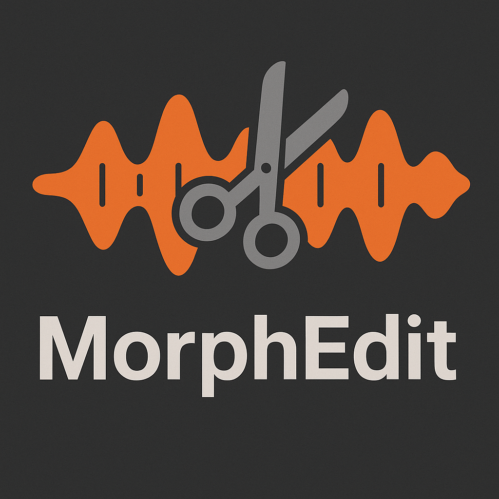
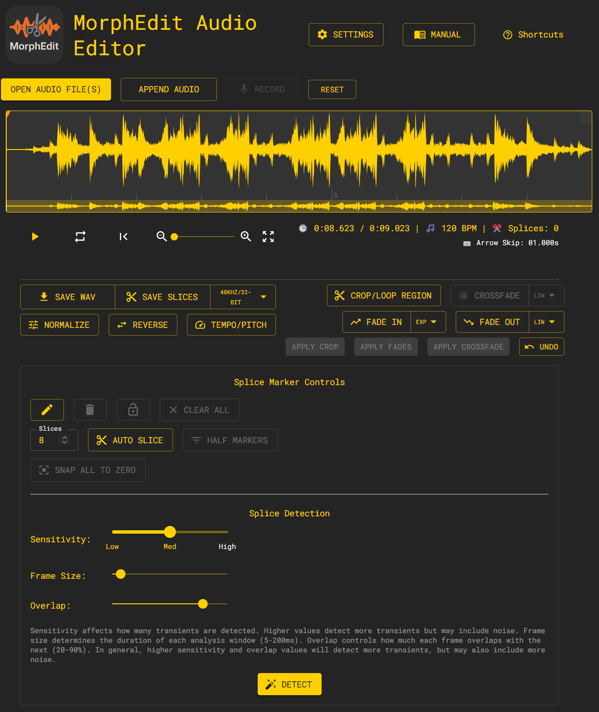

# MorphEdit Audio Editor

<div align="center">



## Professional audio editing for Samplers and beyond

[](https://github.com/carlosedp/morphedit/releases) [](https://github.com/carlosedp/morphedit/actions/workflows/security.yml) [](https://github.com/carlosedp/morphedit/actions/workflows/ci.yml) [](https://opensource.org/licenses/MIT)[](https://codecov.io/gh/carlosedp/morphedit)

[Download](https://github.com/carlosedp/morphedit/releases) • [Documentation](./public/USER_MANUAL.md) • [Report Bug](https://github.com/carlosedp/morphedit/issues) • [Request Feature](https://github.com/carlosedp/morphedit/issues)

</div>

## 🎵 About

MorphEdit is a powerful, browser-based audio editor designed for preparing audio files for samplers and hardware instruments. While offering some features for the **MakeNoise Morphagene** granular synthesis module, it serves as a versatile tool for general audio editing tasks including splicing, cropping, fading, and concatenation making it perfect for audio sample manipulation across various sampling devices.

**No installation required** - runs entirely in your browser with professional-grade audio processing capabilities.

**Complete privacy** - all audio processing happens locally in your browser, ensuring your files never leave your device and **never get uploaded to a server**.



## ✨ Key Features

### 🎯 **Splice Marker Management**

- Add, remove, and lock splice points with precision
- Automatic transient detection with adjustable sensitivity
- Zero-crossing snap to prevent audio artifacts
- Play individual splice markers with keyboard shortcuts (1-0, Q-P)
- Import existing cue points from audio files

### 🎛️ **Professional Audio Processing**

- **Tempo and Pitch Processing**: Professional-grade tempo and pitch shifting with RubberBand
- Multiple fade curve types (linear, exponential, logarithmic)
- Crop regions with sample-accurate precision
- Audio concatenation with preserved splice markers
- Normalization and gain adjustment
- BPM detection and display

### 📤 **Flexible Export Options**

- Multiple sample rates and bit depths for other samplers
- Optimized Morphagene format (48kHz, 32-bit WAV)
- Export individual splice segments
- Batch processing support
- **Configurable Defaults**: Customizable export formats and processing settings

### 🖥️ **Modern Interface**

- Responsive design for desktop, tablet, and mobile
- High-resolution waveform visualization
- Mouse wheel zoom with smooth navigation
- Material-UI components for professional appearance
- Comprehensive keyboard shortcuts
- **Customizable Settings**: Configurable fade curves, crossfade duration, detection sensitivity, and export formats

### 🔧 **Advanced Workflow**

- Drag-and-drop file loading
- Multiple file concatenation
- Undo/redo functionality
- Background processing indicators
- File length warnings and truncation options
- **Persistent Configuration**: Settings automatically saved and preserved across sessions

## 🚀 Quick Start

### Option 1: Use Online (Recommended)

Visit the [live application](https://carlosedp.github.io/morphedit/) - no installation required!

### Option 2: Install as PWA (Progressive Web App)

For offline use and a native app experience:

1. Visit the [live application](https://audioedit.carlosedp.com) in Chrome, Firefox*, or Edge
2. Look for the "Install" button in your browser's address bar or menu
3. Click "Install MorphEdit" to add it to your desktop/home screen
4. Launch anytime as a standalone app with full offline functionality

**Benefits of PWA installation:**

- Works offline after initial load
- Native app-like experience
- No browser UI clutter
- Desktop shortcut/app launcher integration
- Automatic updates when online

*Note: Firefox may require enabling PWA support in `about:config` (search for `browser.taskbarTabs.enabled`) and restart your browser. Support for it is still not 100% functional, so Chrome or Edge is recommended for the best experience in this install option.

### Option 3: Download Desktop App

Download the latest release for your platform from [GitHub Releases](https://github.com/carlosedp/morphedit/releases).

### Option 4: Run from Source

First install [Bun](https://bun.sh/) (a modern JavaScript runtime) according to the Bun Website. We use Bun for its speed and efficiency in handling JavaScript projects, including TypeScript support and fast package management instead of Node.js, npm or yarn.

Then clone the repository and run the development server:

```bash
git clone https://github.com/carlosedp/morphedit.git
cd morphedit
bun install
bun run dev
```

Open [http://localhost:5173](http://localhost:5173) to view the application.

## 📖 Documentation

- **[Complete User Manual](./public/USER_MANUAL.md)** - Comprehensive guide with screenshots
- **[Feature List](./docs/FeatureList.md)** - Detailed feature tracking and roadmap
- **[Auto-Update Setup](./docs/AUTO_UPDATE_SETUP.md)** - Desktop app update configuration
- **[PWA Deployment Guide](./docs/PWA_DEPLOYMENT.md)** - Progressive Web App installation and offline usage

## 🎯 Perfect for Morphagene Users and Eurorack Sampler users

MorphEdit streamlines the Morphagene workflow by:

- **Optimal File Preparation**: Exports in Morphagene's preferred 48kHz/32-bit format
- **Splice Point Precision**: Zero-crossing alignment prevents clicks and pops
- **Length Management**: Automatic 174-second length optimization
- **Tempo Matching**: Adjust audio tempo to fit your composition timing
- **Pitch Correction**: Transpose samples to match your musical key
- **Cue Point Support**: Imports and exports standard cue points
- **Preview Playback**: Test splice points before transferring to hardware

## 🛠️ Technology Stack

- **Frontend**: React 19, TypeScript, Material-UI
- **Audio Processing**: WaveSurfer.js, Web Audio API, RubberBand WASM
- **State Management**: Zustand
- **Build Tool**: Vite
- **Desktop**: Electron  
- **PWA Support**: Service Worker, Web App Manifest, Offline Caching
- **Deployment**: GitHub Pages

## 🤝 Contributing

Contributions are welcome! Please feel free to submit a Pull Request. For major changes, please open an issue first to discuss what you would like to change.

## 📝 License

This project is licensed under the MIT License - see the [LICENSE](LICENSE) file for details.

## 🙏 Acknowledgments

- Built with [WaveSurfer.js](https://wavesurfer-js.org/) for audio visualization
- Audio processing powered by [RubberBand](https://breakfastquay.com/rubberband/) for tempo and pitch shifting
- Designed for the [MakeNoise Morphagene](https://www.makenoisemusic.com/modules/morphagene) community and beyond
- Icons from [Material-UI Icons](https://mui.com/material-ui/material-icons/)

---

<div align="center">

Made with ❤️ for the modular synthesis community

[⭐ Star this repo](https://github.com/carlosedp/morphedit) if you find it useful!

</div>
