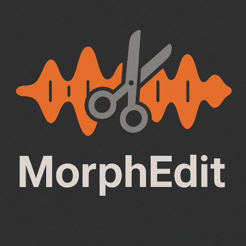
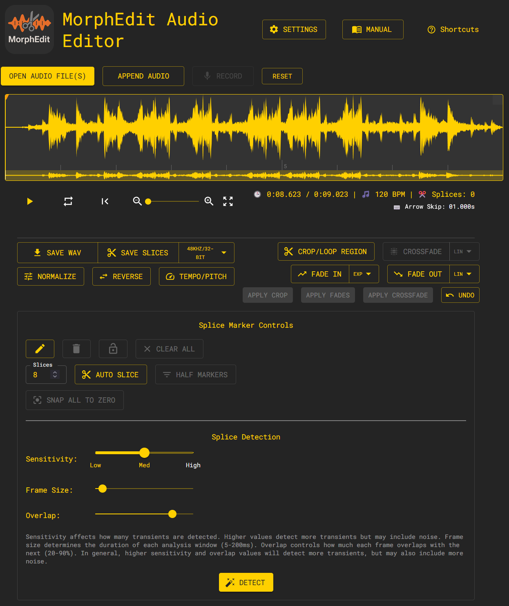

# MorphEdit Audio Editor

## User Manual



## Table of Contents

1. [Introduction](#introduction)
2. [Getting Started](#getting-started)
3. [Interface Overview](#interface-overview)
4. [Loading Audio Files](#loading-audio-files)
5. [Waveform Navigation](#waveform-navigation)
6. [Splice Markers](#splice-markers)
7. [Regions and Processing](#regions-and-processing)
8. [Tempo and Pitch Processing](#tempo-and-pitch-processing)
9. [Exporting Audio](#exporting-audio)
10. [Keyboard Shortcuts](#keyboard-shortcuts)
11. [Mobile and Responsive Design](#mobile-and-responsive-design)
12. [Advanced Features](#advanced-features)
13. [Troubleshooting](#troubleshooting)

---

## Introduction

**MorphEdit** is a browser-based audio editor specifically designed for preparing audio files for the **MakeNoise Morphagene** granular synthesis module. It provides powerful tools for adding splice markers, cropping audio, applying fades, and exporting in the optimal format for the Morphagene.

Although primarily focused on Morphagene users, MorphEdit can also be used for general audio editing tasks such as cropping, fading, and concatenating audio files.



### Key Features

- **Splice Marker Management**: Add, remove, lock, and automatically detect splice points
- **Direct Splice Playback**: Play individual splice markers with keyboard shortcuts (1-0, Q-P)
- **Audio Processing**: Crop, fade in/out, and concatenate multiple files
- **Tempo and Pitch Processing**: Professional-grade tempo and pitch shifting with RubberBand
- **Audio Normalization**: Professional-grade normalization to -1dB peak for optimal levels
- **BPM Detection**: Automatic tempo detection and display for musical content
- **File Appending**: Add new audio files to existing compositions with preserved markers
- **Transient Detection**: Automatically detect audio transients for splice placement
- **Zero-Crossing Snap**: Align markers to zero crossings to prevent audio artifacts
- **Multiple Export Formats**: Export to various sample rates and bit depths
- **Concatenation Support**: Combine multiple audio files with preserved splice markers
- **Undo Functionality**: Easily revert processing operations
- **Keyboard Shortcuts**: Fast workflow with comprehensive keyboard support
- **Responsive Design**: Works seamlessly on desktop, tablet, and mobile devices
- **Mouse Wheel Zoom**: Smooth zooming with mouse wheel for precise navigation
- **Advanced Fade Curves**: Multiple fade curve types (linear, exponential, logarithmic)

---

## Getting Started

### System Requirements

- Modern web browser (Chrome, Firefox, Safari, Edge)
- No installation required - runs entirely in the browser
- Audio files in common formats (WAV, MP3, FLAC, etc.)
- Responsive design supports desktop, tablet, and mobile devices

### Opening the Application

1. Navigate to the MorphEdit URL in your web browser
2. The application loads with an empty waveform display
3. You can immediately start by loading an audio file

**Mobile Users**: The interface automatically adapts to smaller screens with optimized touch controls and reorganized layouts for better usability on mobile devices.

---

## Interface Overview

The MorphEdit interface consists of several main sections:

### 1. Waveform Display

- **Main Canvas**: Shows the audio waveform with time ruler
- **Timeline**: Displays time markers and current position
- **Hover Information**: Shows precise time information when hovering


### 2. Playback Controls (Top Section)

- **Play/Pause Button**: Start/stop audio playback
- **Loop Toggle**: Enable/disable loop mode
- **Rewind Button**: Return to beginning of audio or crop region
- **Zoom Controls**: Adjust waveform zoom level and reset zoom
- **Skip Controls**: Navigate forward/backward with adjustable increments
- **Time Display**: Shows current time, duration, and zoom level
- **BPM Display**: Shows detected BPM (tempo) of the loaded audio file
- **Region Information**: Displays active crop and fade region details


### 3. Export and Region Controls (Middle Section)

- **Export Button**: Quick export in default Morphagene format
- **Export Menu**: Access to multiple export formats
- **Crop Region**: Create and apply crop regions
- **Fade Regions**: Create fade-in and fade-out regions
- **Apply/Undo Buttons**: Process audio and revert changes


### 4. Splice Marker Controls (Bottom Section)

- **Manual Controls**: Add, remove, and lock splice markers
- **Auto-Slice**: Create equally distributed markers
- **Transient Detection**: Automatically detect splice points
- **Marker Management**: Half markers, clear all, snap to zero crossings


---

## Loading Audio Files

### Single File Loading

1. **Drag and Drop**: Simply drag an audio file onto the waveform area
2. **File Menu**: Use browser file selection (if available)
3. **Supported Formats**: WAV, MP3, FLAC, M4A, and other common audio formats

### Multiple File Loading (Concatenation)

1. **Drag Multiple Files**: Select and drag multiple audio files at once
2. **Automatic Processing**: Files are automatically concatenated in the order selected
3. **Splice Marker Placement**: Markers are automatically placed at file boundaries
4. **Existing Markers**: Any existing splice markers (cue points) in the files are preserved

### Appending Audio to Existing Files

When you already have audio loaded in MorphEdit, you can append additional audio files to extend your composition:

#### Using the Append Button

1. **Load Initial Audio**: First load your base audio file
2. **Click "Append Audio"**: Use the "Append Audio" button in the top toolbar
3. **Select Files**: Choose one or more audio files to append
4. **Automatic Processing**: Files are concatenated to the end of existing audio
5. **Marker Preservation**: Existing splice markers are preserved and new boundary markers are added

#### Using Drag and Drop

1. **Drag Files Over Loaded Audio**: When audio is already loaded, drag new files onto the waveform
2. **Choose Action**: A dialog appears with options:
   - **"Replace current audio"**: Removes existing audio and loads new files
   - **"Append to existing audio"**: Adds new files to the end of current audio
3. **Automatic Boundaries**: Splice markers are automatically placed at the junction between files

#### Append Features

- **Splice Marker Management**: Existing markers remain at their original positions
- **Boundary Markers**: New markers are automatically placed where files join
- **Cue Point Preservation**: Existing cue points in appended files are maintained
- **Length Checking**: Combined audio length is checked against Morphagene limits (174s)
- **Undo Support**: Append operations can be undone with Ctrl+Z

### File Length Handling

- **Morphagene Limit**: The Morphagene has a maximum duration of 174 seconds
- **Automatic Warning**: Files longer than 174 seconds trigger a truncation dialog
- **Truncation Options**: Choose to truncate or keep the full length for other uses

---

## Waveform Navigation

### Zoom Controls

- **Zoom In/Out**: Use the zoom slider or keyboard shortcuts (=/-)
- **Mouse Wheel Zoom**: Scroll mouse wheel over waveform to zoom in/out smoothly
  - **Enhanced Performance**: Smooth zooming with optimized step calculation
  - **Context-Aware**: Zoom steps adjust based on current zoom level for better control
  - **Precise Control**: 10% increments based on current zoom for fine adjustments
- **Zoom Reset**: Double-click zoom slider or use reset button to fit audio to window
- **Auto-Zoom**: New audio files automatically zoom to fit the container

### Playback Navigation

- **Click to Seek**: Click anywhere on the waveform to jump to that position
- **Skip Forward/Backward**: Use arrow keys or buttons to navigate precisely
- **Skip Increment**: Adjustable skip amount (0.1s to 10s) using up/down arrows
- **Loop Mode**: Toggle to continuously loop playback

### Visual Feedback

- **Current Time Cursor**: White vertical line shows current playback position
- **Hover Timeline**: Displays precise time information while hovering
- **Progress Color**: Waveform shows progress with contrasting colors

---

## Splice Markers

Splice markers are the core feature for preparing audio for the Morphagene. They define where the audio can be "sliced" for granular playback.

### Manual Marker Management

#### Adding Markers

1. **Position Cursor**: Click or seek to desired position
2. **Add Marker**: Press 'J' or click the "Add" button (Create icon)
3. **Zero-Crossing Snap**: Markers automatically snap to nearest zero crossing to prevent clicks


#### Removing Markers

1. **Select Marker**: Click on a splice marker (turns blue when selected)
2. **Remove Selected**: Press 'K' or click the "Remove" button (Delete icon)
3. **Remove Closest**: If no marker selected, removes closest unlocked marker to cursor

#### Playing Splice Markers

MorphEdit provides direct keyboard shortcuts to play individual splice markers for auditioning:

1. **Direct Playback**: Use number keys 1-0 and letter keys Q-P to play the first 20 splice markers
2. **Automatic Stopping**: Playback automatically stops at the next splice marker
3. **Chronological Order**: Markers are played in chronological order (sorted by time position)
4. **Visual Feedback**: Console displays which marker is being played and where it will stop

**Keyboard Layout for Splice Playback:**

- **1-0**: Play splice markers 1-10
- **Q-P**: Play splice markers 11-20

This feature allows you to quickly audition different segments of your audio by jumping directly to splice points and hearing exactly what each slice contains.

#### Locking Markers

1. **Select Marker**: Click on the marker you want to lock
2. **Toggle Lock**: Press 'M' or click the lock button
3. **Visual Indication**: Locked markers show a lock icon (🔒) and cannot be moved or deleted
4. **Protection**: Locked markers are preserved during auto-slice and clear operations


### Automatic Marker Generation

#### Auto-Slice

1. **Set Number**: Choose how many equal sections to create (2-100)
2. **Generate**: Press 'S' or click "Auto Slice"
3. **Locked Preservation**: Existing locked markers are preserved
4. **Zero-Crossing**: New markers automatically snap to zero crossings


#### Transient Detection

1. **Configure Sensitivity**: Adjust detection sensitivity (0-100)
   - **Low (0-30)**: Detects only strong transients
   - **Medium (30-70)**: Balanced detection
   - **High (70-100)**: Detects subtle changes
2. **Advanced Settings**:
   - **Frame Size**: Analysis window duration (5-50ms)
   - **Overlap**: Window overlap percentage (50-90%)
3. **Detect**: Click "Detect" to automatically find transients
4. **Results**: Markers placed at detected transient positions


### Marker Management Tools

#### Half Markers

- **Function**: Removes every other unlocked marker (keeps 1st, 3rd, 5th, etc.)
- **Use Case**: Reduce marker density while maintaining timing
- **Shortcut**: Press 'H'

#### Clear All Markers

- **Function**: Removes all unlocked markers
- **Protection**: Locked markers are preserved
- **Shortcut**: Press 'X'

#### Snap to Zero Crossings

- **Function**: Moves all existing markers to nearest zero crossings
- **Purpose**: Eliminates audio artifacts (clicks/pops)
- **Recommended**: Use before final export

---

## Regions and Processing

### Crop Regions

#### Creating Crop Regions

1. **Toggle Mode**: Press 'C' or click "Crop Region" button
2. **Position Region**: Drag the handles to set start and end points
3. **Visual Feedback**: Yellow highlighted area shows crop region
4. **Loop Playback**: When loop is enabled, plays only the crop region

#### Applying Crop

1. **Review Region**: Ensure crop boundaries are correct
2. **Apply**: Click "Apply Crop" button
3. **Processing**: Audio is cropped to the selected region
4. **Marker Adjustment**: Splice markers within the region are automatically adjusted
5. **Undo Available**: Previous state is saved for undo operation


### Fade Regions

#### Fade-In

1. **Create**: Press '[' or click "Fade In" button
2. **Adjust**: Drag handles to set fade duration (default: 10% of audio length)
3. **Preview**: Green highlighted area shows fade-in region

#### Fade-Out

1. **Create**: Press ']' or click "Fade Out" button
2. **Adjust**: Drag handles to set fade duration (default: last 10% of audio)
3. **Preview**: Red highlighted area shows fade-out region

#### Fade Curve Types

MorphEdit now supports different fade curve types for both fade-in and fade-out:

1. **Linear**: Constant fade rate (default)
2. **Exponential**: Smooth, gradual start - more natural sounding
3. **Logarithmic**: Quick start, gentle end - more dramatic effect

Each fade region (in/out) has its own curve selector dropdown next to the fade button.


#### Applying Fades

1. **Multiple Fades**: Can apply both fade-in and fade-out simultaneously
2. **Curve Selection**: Choose different curve types for fade-in and fade-out independently
3. **Apply**: Click "Apply Fades" button
4. **Custom Curves**: Uses the selected curve type for gain reduction/increase
5. **Zero-Crossing**: Fade boundaries snap to zero crossings


With fades applied:


### Audio Normalization

MorphEdit includes audio normalization to optimize your audio levels for consistent playback and processing.

#### What is Normalization?

Audio normalization adjusts the gain of your audio so that the loudest peak reaches a target level (in MorphEdit, this is -1dB). This:

- **Maximizes Dynamic Range**: Uses the full available headroom without clipping
- **Ensures Consistency**: Multiple files will have similar perceived loudness
- **Prevents Distortion**: Leaves 1dB of headroom to avoid digital clipping
- **Optimizes for Hardware**: Provides optimal levels for the Morphagene and other hardware

#### How to Apply Normalization

1. **Load Audio**: First load your audio file with splice markers if desired
2. **Access Feature**: Look for the "Normalize" button in the processing controls
3. **Apply**: Click "Normalize" to process the audio to -1dB peak level

### Undo Functionality

- **Single Level**: Can undo the last processing operation (crop, fade, or tempo/pitch)
- **Keyboard**: Press Ctrl+Z (Windows/Linux) or Cmd+Z (Mac)
- **Button**: Click the "Undo" button
- **Limitations**: Only one level of undo is available

---

## Tempo and Pitch Processing

MorphEdit includes advanced tempo and pitch processing capabilities using the RubberBand audio processing library. This allows you to change the speed and pitch of your audio independently or together, while maintaining high audio quality.


### Accessing Tempo and Pitch Controls

1. **Tempo/Pitch Button**: Click the "Tempo/Pitch" button in the waveform controls
2. **Dialog Opens**: A comprehensive dialog with all tempo and pitch options
3. **Advanced Options**: Multiple quality and processing settings available

### Basic Controls

#### Tempo Adjustment

- **Tempo Mode**: Which parameter to use for tempo adjustment (Percentage, Ratio or BPM)
- **Range**: 25% to 250% of original speed
- **Default**: 100% (no change)
- **Independent**: Can be adjusted without affecting pitch
- **Examples**:
  - 50% = Half the length
  - 200% = Double the lenght
  - Setting a higher BPM in BPM mode will speed up the audio, while a lower BPM will slow it down.
  - 0.5x ratio will halve the audio length, while 2.0x will double it.

In BPM mode, you can set the exact BPM you want to achieve and the tempo will be adjusted accordingly. The BPM is automatically detected when loading the audio file.

The estimated new audio length is displayed in the dialog.

#### Pitch Adjustment

- **Range**: -24 to +24 semitones
- **Default**: 0 semitones (no change)
- **Independent**: Can be adjusted without affecting tempo
- **Examples**:
  - -12 semitones = One octave down
  - +12 semitones = One octave up
  - +7 semitones = Perfect fifth up

### Advanced Settings

#### Processing Quality

- **High Quality Pitch**: Enhanced pitch processing (recommended on)
- **High Quality Tempo**: Enhanced tempo processing (recommended on)
- **Formant Preservation**: Maintains vocal character when pitch shifting

#### Transient Detector

- **Compound**: Balanced detection for most audio types (default)
- **Percussive**: Optimized for drums and percussive content
- **Soft**: Gentle detection for sustained sounds

#### Additional Options

- **Smoothing**: Reduces artifacts but may soften transients
- **Real-time Mode**: Faster processing for quick previews

### Workflow Tips

#### For Musical Content

1. **Preserve Formants**: Enable for vocal content to maintain natural sound
2. **High Quality**: Use both HQ options for final processing
3. **Detector Choice**: Use "Compound" for most music, "Percussive" for drums

#### For Morphagene Use

1. **Tempo Changes**: Adjust tempo to fit desired slice timing
2. **Pitch Matching**: Match pitch to other samples in your collection
3. **Length Considerations**: Remember 174-second limit after processing

#### Processing Considerations

- **Marker Adjustment**: Splice markers are automatically scaled with tempo changes
- **BPM Recalculation**: BPM is automatically re-detected after processing
- **Undo Support**: Processing can be undone like other operations
- **Quality vs Speed**: Higher quality settings take longer to process

### Technical Notes

#### Audio Quality

- **RubberBand Engine**: Professional-grade audio processing
- **Artifact Minimization**: Advanced algorithms reduce processing artifacts
- **Frequency Preservation**: Maintains audio frequency content quality

#### Performance

- **Processing Time**: Depends on audio length and quality settings
- **Memory Usage**: Large files may require significant memory
- **Background Processing**: UI remains responsive during processing

---

## Exporting Audio

### Quick Export (Default)

1. **Format**: 48kHz, 32-bit Float, Stereo (optimal for Morphagene)
2. **Export**: Click "Export WAV" button
3. **Filename**: Automatically named "morphedit-export.wav"
4. **Splice Markers**: Embedded as WAV cue points for compatibility

### Custom Format Export

1. **Open Menu**: Click the dropdown arrow next to "Export WAV"
2. **Select Format**: Choose from available formats:
   - **48kHz 32-bit Float Stereo** (Morphagene optimal)
   - **44.1kHz 32-bit Float Stereo**
   - **48kHz 16-bit Stereo**
   - **44.1kHz 16-bit Stereo**
   - **44.1kHz 16-bit Mono**
   - **22.05kHz 16-bit Mono**
3. **Download**: File downloads with format-specific filename


### Export Features

- **Cue Point Embedding**: Splice markers are saved as WAV cue points
- **Sample Rate Conversion**: Automatic resampling to target format
- **Bit Depth Conversion**: Automatic conversion between 16-bit and 32-bit
- **Channel Conversion**: Automatic mono/stereo conversion
- **Filename Convention**: Includes format details in filename

---

## Keyboard Shortcuts

### Playback Controls

| Key       | Action        | Description                          |
| --------- | ------------- | ------------------------------------ |
| **Space** | Play/Pause    | Start or stop audio playback         |
| **L**     | Toggle Loop   | Enable/disable loop mode             |
| **←**     | Skip Backward | Move backward by skip increment      |
| **→**     | Skip Forward  | Move forward by skip increment       |
| **↑**     | Increase Skip | Increase skip increment (0.1s → 10s) |
| **↓**     | Decrease Skip | Decrease skip increment (10s → 0.1s) |

### Zoom Controls

| Key   | Action   | Description                  |
| ----- | -------- | ---------------------------- |
| **=** | Zoom In  | Increase waveform zoom level |
| **-** | Zoom Out | Decrease waveform zoom level |

### Mouse Controls

| Action          | Description                              |
| --------------- | ---------------------------------------- |
| **Mouse Wheel** | Zoom in/out when scrolling over waveform |
| **Click**       | Seek to position in waveform             |

### Splice Markers

| Key   | Action        | Description                           |
| ----- | ------------- | ------------------------------------- |
| **J** | Add Marker    | Add splice marker at cursor position  |
| **K** | Remove Marker | Remove selected/closest splice marker |
| **M** | Lock/Unlock   | Toggle lock status of selected marker |
| **S** | Auto-Slice    | Create equally distributed markers    |
| **H** | Half Markers  | Remove every other unlocked marker    |
| **X** | Clear All     | Remove all unlocked markers           |

### Splice Marker Playback

| Key   | Action         | Description                  |
| ----- | -------------- | ---------------------------- |
| **1** | Play Splice 1  | Play from 1st splice marker  |
| **2** | Play Splice 2  | Play from 2nd splice marker  |
| **3** | Play Splice 3  | Play from 3rd splice marker  |
| **4** | Play Splice 4  | Play from 4th splice marker  |
| **5** | Play Splice 5  | Play from 5th splice marker  |
| **6** | Play Splice 6  | Play from 6th splice marker  |
| **7** | Play Splice 7  | Play from 7th splice marker  |
| **8** | Play Splice 8  | Play from 8th splice marker  |
| **9** | Play Splice 9  | Play from 9th splice marker  |
| **0** | Play Splice 10 | Play from 10th splice marker |
| **Q** | Play Splice 11 | Play from 11th splice marker |
| **W** | Play Splice 12 | Play from 12th splice marker |
| **E** | Play Splice 13 | Play from 13th splice marker |
| **R** | Play Splice 14 | Play from 14th splice marker |
| **T** | Play Splice 15 | Play from 15th splice marker |
| **Y** | Play Splice 16 | Play from 16th splice marker |
| **U** | Play Splice 17 | Play from 17th splice marker |
| **I** | Play Splice 18 | Play from 18th splice marker |
| **O** | Play Splice 19 | Play from 19th splice marker |
| **P** | Play Splice 20 | Play from 20th splice marker |

*Note: Playback automatically stops at the next splice marker. Markers are accessed in chronological order.*

### Regions

| Key   | Action      | Description                 |
| ----- | ----------- | --------------------------- |
| **C** | Crop Region | Toggle crop region creation |
| **[** | Fade-In     | Toggle fade-in region       |
| **]** | Fade-Out    | Toggle fade-out region      |

### System

| Key                | Action | Description                          |
| ------------------ | ------ | ------------------------------------ |
| **Ctrl+Z / Cmd+Z** | Undo   | Undo last processing operation       |
| **\\**             | Reset  | Clear all data and reset application |

---

## Mobile and Responsive Design

### Mobile Interface Optimizations

MorphEdit features a fully responsive design that adapts to different screen sizes:

#### Mobile-Specific Features

- **Touch-Optimized Controls**: Larger touch targets for buttons and sliders on mobile devices
- **Reorganized Layout**: Interface elements stack vertically on smaller screens for better accessibility
- **Adaptive Text Sizing**: Font sizes automatically adjust for optimal readability across devices
- **Gesture Support**: Touch gestures for seeking and region adjustment
- **Optimized Spacing**: Button and control spacing optimized for touch interaction

#### Cross-Device Compatibility

- **Desktop**: Full-featured interface with all keyboard shortcuts and mouse interactions
- **Tablet**: Hybrid interface supporting both touch and keyboard input
- **Mobile**: Streamlined interface prioritizing essential functions with touch-first design

#### Performance Considerations

- **Efficient Rendering**: Optimized waveform rendering for mobile GPUs
- **Memory Management**: Careful resource management for mobile browsers
- **Battery Optimization**: Efficient processing to minimize battery drain

---

## Advanced Features

### File Operations and Dialogs

#### File Replacement Dialog

When dragging files onto an already loaded audio file, MorphEdit presents options:

- **Replace current audio**: Removes existing audio and loads new files
- **Append to existing audio**: Adds new files to the end of current audio
- **Cancel**: Cancels the operation


#### Length Warning Dialog

When audio exceeds the Morphagene's 174-second limit, options are presented:

- **Truncate to 174 seconds**: Keeps only the first 174 seconds
- **Keep full length**: Maintains original length (for non-Morphagene use)
- **Cancel**: Cancels the operation


#### Loading States

- **File Loading**: Shows progress when loading/processing audio files
- **Append Operations**: Displays "Appending audio files..." during concatenation
- **Processing Operations**: Shows progress for crop, fade, and export operations

### Audio File Management

#### Append vs. Concatenation

- **Concatenation**: Loading multiple files simultaneously creates a single composition
- **Appending**: Adding files to an existing composition extends the current audio
- **Boundary Markers**: Both operations automatically place splice markers at file junctions
- **Marker Preservation**: Existing splice markers and cue points are maintained

#### Undo System

- **Single-Level Undo**: Can undo the last processing operation (crop, fade, tempo/pitch, or append)
- **State Preservation**: Previous audio state is stored for restoration
- **Automatic Cleanup**: Undo history is cleared after successful undo operation

### Zero-Crossing Detection

- **Purpose**: Prevents audio artifacts (clicks/pops) when markers are placed
- **Automatic**: All marker placement automatically snaps to zero crossings
- **Manual Tool**: "Snap All to Zero" button adjusts existing markers
- **Algorithm**: Finds nearest point where waveform crosses zero amplitude

### BPM Detection

MorphEdit automatically detects the BPM (Beats Per Minute) of loaded audio files and displays it in the interface.

#### How BPM Detection Works

- **Automatic Analysis**: BPM detection runs in the background when audio is loaded
- **Real-Time Display**: Detected BPM appears in the playback controls section as "🎵 XXX BPM"

#### BPM Display

- **Format**: Shows as "🎵 120 BPM" in the interface (example)
- **Fallback**: Displays "🎵 -- BPM" if detection fails or times out
- **Precision**: Results are rounded to one decimal place for readability
- **Update**: BPM is recalculated when new audio is loaded

### Concatenation Support

- **Multiple Files**: Load multiple audio files simultaneously
- **Automatic Markers**: Splice markers placed at file boundaries
- **Cue Point Preservation**: Existing cue points in files are maintained
- **Time Adjustment**: All markers adjusted for concatenated timeline

### Sample Rate Handling

- **Mixed Rates**: Handles files with different sample rates
- **Automatic Resampling**: Converts to common rate for processing
- **Export Flexibility**: Can export to different rates than source

### Processing Indicators

- **Loading States**: Visual feedback during file loading
- **Processing States**: Shows progress for crop and fade operations
- **Error Handling**: Clear feedback for any processing errors

### Debug Tools

- **Browser Console**: Access to debug functions for troubleshooting
- **Region Inspector**: Use `debugListRegions()` in browser console
- **Marker Validation**: Shows marker counts and positions

---

## Troubleshooting

### Common Issues

#### Audio Not Loading

1. **Check Format**: Ensure file is in supported format (WAV, MP3, FLAC)
2. **File Size**: Very large files may take time to load
3. **Browser Compatibility**: Try a different browser if issues persist
4. **File Corruption**: Try loading a different audio file

#### Markers Not Appearing

1. **Zoom Level**: Zoom in to see markers more clearly
2. **File Compatibility**: Some files may not have readable cue points
3. **Processing State**: Wait for any ongoing processing to complete

#### Export Issues

1. **Browser Downloads**: Check browser download settings
2. **File Size**: Large files may take time to process
3. **Format Support**: Try different export formats if issues occur

#### Performance Issues

1. **File Length**: Very long files may impact performance
2. **Browser Memory**: Close other tabs to free up memory
3. **Zoom Level**: High zoom levels may slow interaction

#### Tempo/Pitch Processing Issues

1. **Processing Fails**: Ensure audio is fully loaded before applying tempo/pitch processing
2. **Long Processing Time**: Large files or high-quality settings take longer to process
3. **Audio Quality**: Use high-quality settings for final processing, real-time for testing
4. **Memory Issues**: Very long files may require significant memory for processing
5. **Browser Compatibility**: Modern browsers required for WASM processing support

### Browser Console Debug

For advanced troubleshooting, open browser developer tools (F12) and use:

```javascript
// List all regions and markers
debugListRegions()
```

This provides detailed information about:

- All splice markers with positions and lock status
- Region information (crop, fade-in, fade-out)
- Store synchronization status
- Visual marker count vs. stored marker count

### File Compatibility

#### Supported Input Formats

- **WAV**: Full support including existing cue points
- **MP3**: Good support, no cue point reading
- **FLAC**: Good support, no cue point reading
- **M4A/AAC**: Basic support
- **OGG**: Basic support

#### Recommended Workflow

1. **Source Format**: Use WAV files when possible for best compatibility
2. **Cue Points**: WAV files with existing cue points are automatically loaded
3. **Sample Rate**: 48kHz or 44.1kHz recommended for best results
4. **File Length**: Keep under 174 seconds for Morphagene compatibility

---

## Tips and Best Practices

### Workflow Recommendations

#### For Morphagene Users

1. **Start with Quality Source**: Use high-quality WAV files when possible
2. **Length Management**: Keep files under 174 seconds or use truncation
3. **Marker Strategy**: Place markers at musically relevant points (beats, phrases)
4. **Zero-Crossing**: Always use "Snap All to Zero" before final export
5. **Export Format**: Use default 48kHz 32-bit Float Stereo format

#### General Audio Editing

1. **Backup Originals**: Keep original files safe before processing
2. **Incremental Edits**: Make small changes and test frequently
3. **Undo Usage**: Remember only one level of undo is available
4. **Preview Regions**: Use loop mode to preview crop regions before applying

### Marker Placement Strategy

#### Musical Content

- **Beats**: Place markers on strong beats for rhythmic slicing
- **Phrases**: Mark beginnings of musical phrases
- **Texture Changes**: Mark where timbre or dynamics change significantly

#### Transient Detection Tips

- **Sensitivity Tuning**: Start with medium (50) and adjust based on results
- **Frame Size**: Smaller frames (5-10ms) for percussive content, larger (20-50ms) for sustained sounds
- **Manual Refinement**: Use automatic detection as starting point, then manually adjust

### Performance Optimization

- **File Preparation**: Pre-process very long files in external editors if needed
- **Marker Density**: Use reasonable marker density (not too many for short files)
- **Browser Resources**: Close unnecessary tabs and applications

---

## Common Workflows

### Building a Composition with Multiple Sources

1. **Start with Base Audio**: Load your primary/longest audio file first
2. **Add Splice Markers**: Use transient detection or manual placement on the base audio
3. **Append Additional Elements**:
   - Use "Append Audio" button to add drums, textures, or other elements
   - Each appended file automatically gets boundary markers
4. **Refine Markers**: Adjust marker positions and lock important ones
5. **Test Playback**: Use number keys (1-0) and letters (Q-P) to audition different slices
6. **Apply Processing**: Add fades or crop if needed
7. **Export**: Export to WAV with embedded splice markers

### Creating Variations from Existing Compositions

1. **Load Base Composition**: Start with an existing audio file with splice markers
2. **Experiment with Appends**: Add new elements to create variations
3. **Use Undo**: Quickly revert to try different combinations
4. **Lock Key Markers**: Preserve important splice points during auto-slice operations
5. **Export Multiple Versions**: Create different exports for comparison

### Preparing Loops and Samples

1. **Individual Loop Processing**:
   - Load single loop files
   - Use transient detection for automatic slice points
   - Fine-tune with manual adjustments
2. **Loop Set Assembly**:
   - Start with your main loop
   - Append variations, fills, and breaks
   - Test transitions using splice playback
3. **Morphagene Optimization**:
   - Keep total length under 174 seconds
   - Use appropriate splice density (8-20 markers typically)
   - Export in 48kHz 32-bit format

### Quick Audition Workflow

1. **Load Audio**: Import your audio file(s)
2. **Auto-Generate Markers**: Use auto-slice (8-16 slices) or transient detection
3. **Rapid Testing**: Use keyboard shortcuts to quickly play through slices:
   - Press 1-0 to hear first 10 slices
   - Press Q-P to hear slices 11-20
4. **Refinement**: Adjust or remove markers that don't sound good
5. **Final Export**: Export when satisfied with slice points

---

This manual covers all the core functionality of MorphEdit. For the most current information and updates, refer to the application's built-in help or project documentation.
